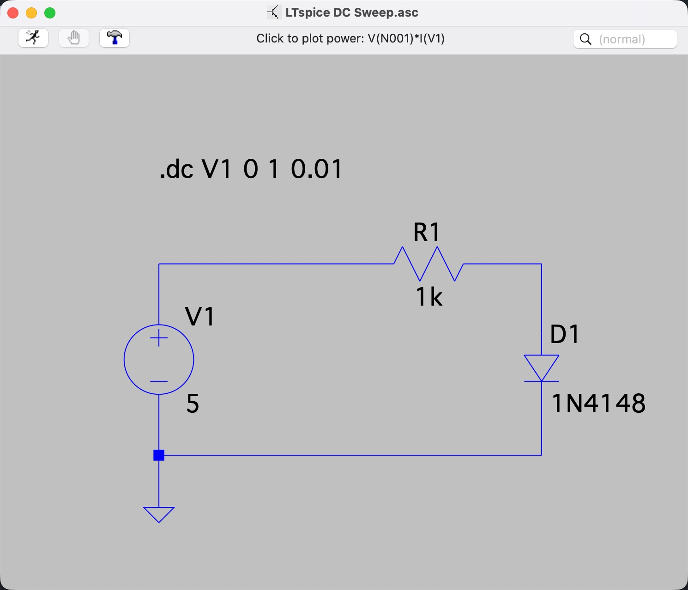
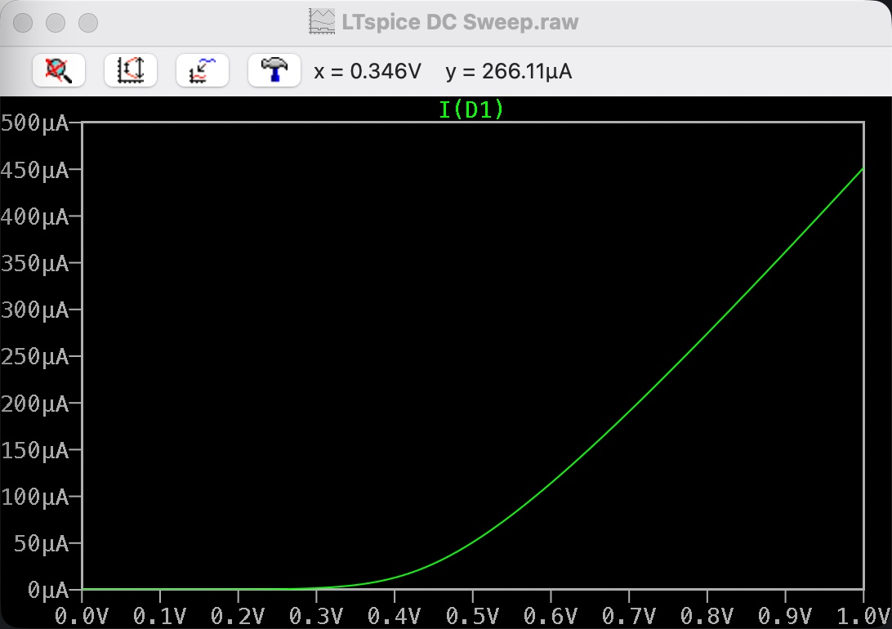
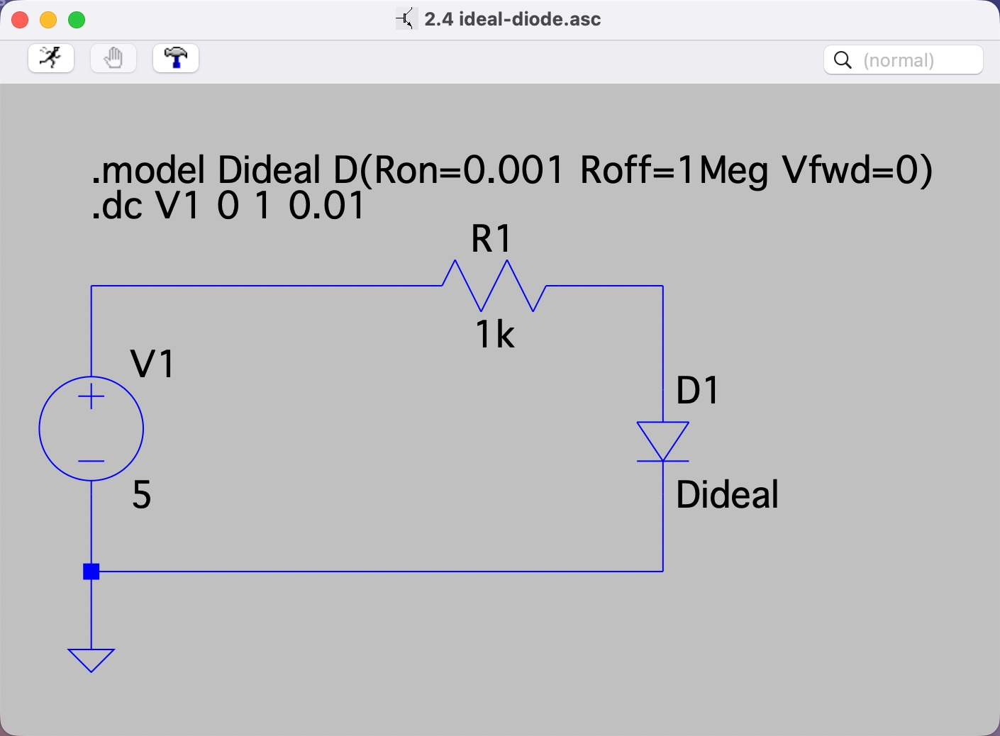
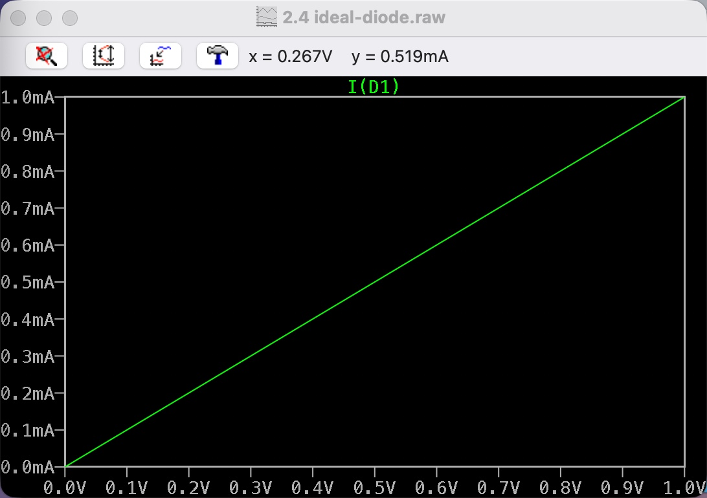

# Assignment 2.4 – Ideal vs Practical Diode Models

## Practical Model

## Ideal Model

## Difference in turn-on voltage

The ideal diode turns on at 0 V, so current starts immediately.
The real diode (like 1N4148) needs about 0.6–0.7 V before significant current flows.

## Difference in current behavior

In the ideal diode, current increases linearly because only the resistor limits the current.
In the real diode, current increases exponentially, so the curve bends sharply upward after the turn-on region.

## Why ideal models are still used

Ideal models are used because they are simple and help understand basic circuit behavior without complex equations.

## When ideal models become inaccurate

Ideal models are inaccurate when voltage drop, leakage current, temperature effects, or high accuracy are important, because real components do not behave perfectly.