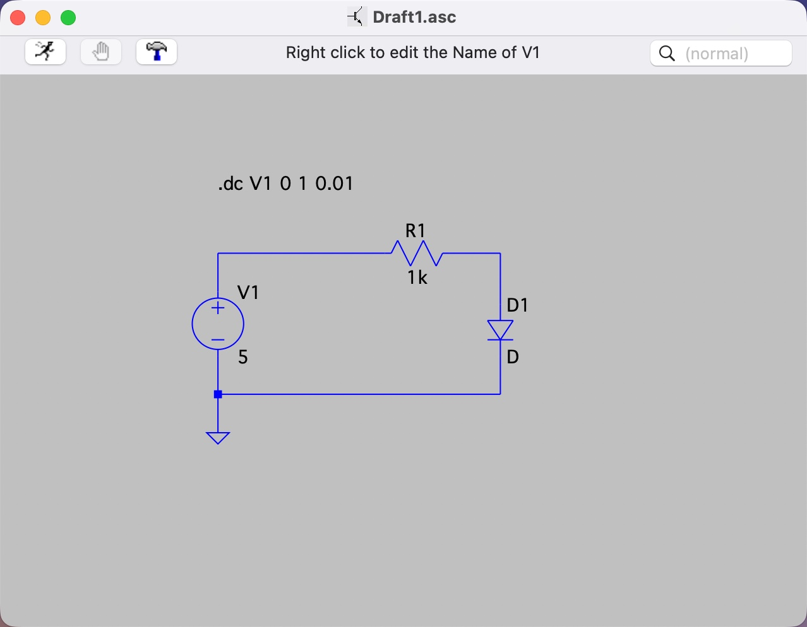
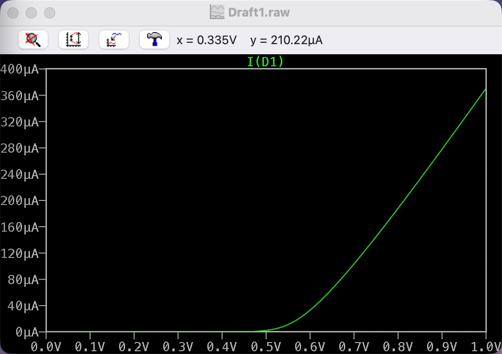

# Analog Electronics 1 2026

Ding Han

## Assignment 2.1

[2.1 Semiconductor Basics.md](2.1%20Semiconductor%20Basics.md)

## Assignment 2.2

**Sweep range:** 0V - 1V

The plot shows that the diode current stays very small at low voltage, then around 0.7 V it starts to increase very quickly.

## Assignment 2.3

[2.3 Diode Datasheet Analysis.md](2.3%20Diode%20Datasheet%20Analysis.md)
