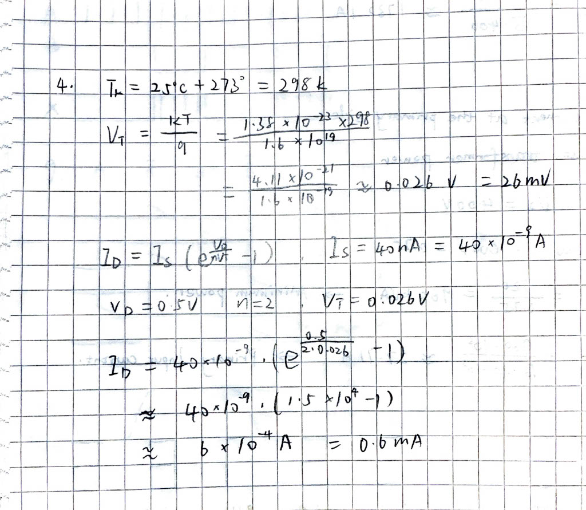

1. There are two types after doping: n-type and p-type
    n-type materials contain an excess of conduction band electrons.
    p-type materials contain an excess of valence band holes

2. In forward bias, the external voltage reduces the barrier at the p–n junction, allowing electrons and holes to cross the junction easily, so a large current flows.

    In reverse bias, the external voltage increases the barrier and widens the depletion region, preventing charge carriers cross, only a very small current flows.

3. An ideal as applied to a device or a system is a simplified theoretical model that works perfectly, with no losses and it behave exactly as the theory.

4.
    

